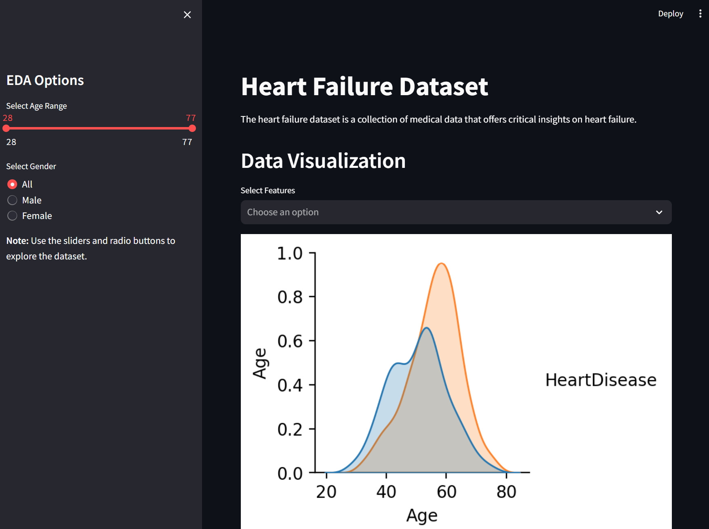

# Data Visualization App for Heart failure dataset using Streamlit

This repository contains a Streamlit web application for visualizing and analyzing a heart dataset. 

## Features
- Visualize key statistics and distributions related to heart health.
- Interactively filter and explore the dataset.
- Gain insights into factors affecting heart disease.



### Demo
You can try the live demo of the Streamlit app here: [webapp](https://heart-disease-bwpbqh2kcfpb3kocxewdvl.streamlit.app/)

### Installation
1. Clone the repo to local:
```shell
git clone https://github.com/SivaTSS/heart-disease.git
```
2. Install the required dependencies:
```shell
pip install -r requirements.txt
```

### Usage
On the terminal run the below command to launch streamlit:
```shell
streamlit run streamlit-app.py
```
The app will be available on http://localhost:8501/